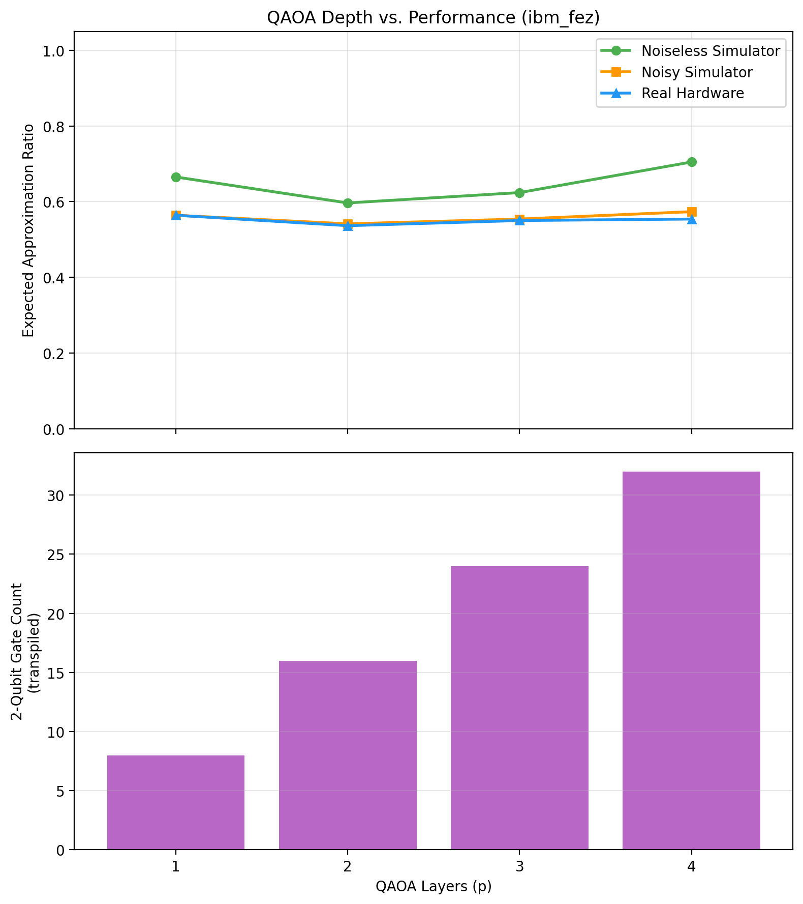

# QAOA MaxCut on Real IBM Quantum Hardware

A hybrid quantum-classical optimization project applying QAOA (Quantum Approximate
Optimization Algorithm) to a MaxCut problem built from real stock correlation data,
benchmarked across a noiseless simulator, a calibration-based noisy simulator, and
real IBM Quantum hardware.

## Overview

Given daily returns for six large-cap tech stocks (AAPL, MSFT, GOOGL, AMZN, NVDA, META),
this project builds a correlation graph and uses QAOA to solve MaxCut on it — partitioning
stocks into two groups with minimal intra-group correlation, a proxy for a diversification
heuristic. The core focus, however, is not the finance framing but a rigorous benchmark of
QAOA performance under real NISQ-era noise:

- Exact and greedy classical baselines
- QAOA parameter optimization (multi-restart, per depth)
- Execution on real IBM Quantum hardware via Qiskit Runtime primitives (`SamplerV2`)
  with dynamical decoupling and Pauli twirling
- A calibration-based noise model (`NoiseModel.from_backend`) as an intermediate
  noisy-simulator baseline
- A full depth sweep (p = 1–4) comparing all three environments

## Key Results

| p | Noiseless | Noisy-Sim | Hardware | 2Q Gates (transpiled) |
|---|-----------|-----------|----------|------------------------|
| 1 | 0.665 | 0.564 | 0.564 | 8 |
| 2 | 0.596 | 0.541 | 0.536 | 16 |
| 3 | 0.624 | 0.554 | 0.550 | 24 |
| 4 | 0.705 | 0.573 | 0.554 | 32 |

*(Expected, probability-weighted approximation ratio, averaged over all measured bitstrings)*

**Findings:**

1. **Noiseless QAOA performance improves with depth** (0.665 → 0.705 from p=1 to p=4),
   consistent with theory — more layers give the ansatz more expressive power to approach
   the true ground state.
2. **Real hardware performance stays flat (~0.53–0.57) regardless of depth.** As p increases,
   the transpiled 2-qubit gate count grows from 8 to 32, and the resulting noise accumulation
   cancels out the theoretical benefit of additional layers — a textbook NISQ-era depth
   trade-off.
3. **A calibration-based noise model predicts real hardware behavior to within ~2 percentage
   points at every depth tested** (noisy-sim vs. hardware gap: 0.000–0.019 across p=1–4),
   validating `NoiseModel.from_backend()` as a reliable low-cost proxy for this circuit class
   before spending QPU time.



## Methodology Notes

- **Metric**: approximation ratio is reported as the probability-weighted expectation over
  all measured bitstrings (not just the single most-probable one), which is the standard,
  noise-robust QAOA benchmark — argmax-based ratios are included in the raw output but are
  sensitive to sampling noise given the flat probability landscape at p=2.
- **Optimization**: each depth is optimized independently with 5 random restarts (Adam,
  80 steps each) on a noiseless simulator, keeping the best-converged result, to avoid
  reporting a spurious local minimum as depth-dependent performance.
- **Hardware**: executed via Qiskit Runtime `SamplerV2` with dynamical decoupling (XY4
  sequence) and gate/measurement twirling enabled. Backend selected automatically via
  `service.least_busy()`; this run used `ibm_fez`.
- **Noise model**: built directly from the target backend's live calibration data at run
  time (`NoiseModel.from_backend(backend)`), so the noisy-simulator comparison reflects the
  same device the hardware job ran on.
- Total QPU time consumed across all experiments: a few seconds.

## Project Structure

├── qaoa_maxcut_ibm.py # Main script (baselines, single-depth run, noise comparison, p-sweep)
├── requirements.txt
├── stock_correlation_graph.png
├── approx_ratio_comparison.png
├── qaoa_p_sweep_with_gates.png
└── README.md

## Setup

```bash
pip install -r requirements.txt
```

You'll need an IBM Quantum account and saved credentials for `QiskitRuntimeService()`
to authenticate — see [IBM Quantum Platform](https://quantum.ibm.com/) for setup.

## Running

```bash
python qaoa_maxcut_ibm.py
```

This will download stock data, build the correlation graph, compute classical baselines,
run the noiseless/noisy/hardware three-way comparison at p=2, then run the full p=1–4 sweep
across all three environments. Real hardware calls require valid IBM Quantum credentials
and will consume QPU time (minimal — see Methodology Notes).

## Possible Extensions

- Zero-noise extrapolation via `EstimatorV2` with `resilience_level=2`
- Scale to a larger stock universe (N=8–10) to see how the noise gap grows with problem size
- Custom qubit layout selection to minimize transpiled SWAPs given the graph's hub structure

## Author

Aditya Singh — M.Sc. Applied Physics, Amity University Lucknow
[ORCID: 0009-0005-5843-2484](https://orcid.org/0009-0005-5843-2484)
