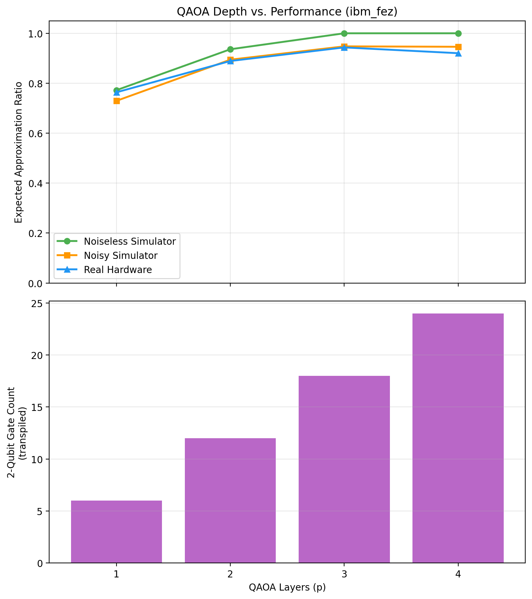

# QAOA MaxCut on Real IBM Quantum Hardware

A hybrid quantum-classical optimization project applying QAOA (Quantum Approximate
Optimization Algorithm) to a MaxCut problem built from real stock correlation data,
benchmarked across a noiseless simulator, a calibration-based noisy simulator, and
real IBM Quantum hardware (`ibm_fez`).

## Overview

Given daily returns for six large-cap tech stocks (AAPL, MSFT, GOOGL, AMZN, NVDA, META),
this project builds a correlation graph (edge between two stocks if |ρ| ≥ 0.30) and uses
QAOA to solve unweighted MaxCut on it, which splits the stocks into two groups so that
highly correlated pairs end up on opposite sides (a toy proxy for a diversification
heuristic). The finance framing is only a source of a realistic graph. The core focus is a
benchmark of QAOA performance under real NISQ-era noise:

- Exact and greedy classical baselines
- QAOA parameter optimization (multi-restart, per depth)
- Execution on real IBM Quantum hardware via Qiskit Runtime primitives (`SamplerV2`)
  with dynamical decoupling and Pauli twirling
- A calibration-based noise model (`NoiseModel.from_backend`) as an intermediate
  noisy-simulator baseline
- A full depth sweep (p = 1–4) comparing all three environments

**The graph in this run.** The trailing one-year window (251 trading days) produced three
edges, all through AMZN: MSFT–AMZN (0.388), GOOGL–AMZN (0.538), AMZN–META (0.396).
AAPL and NVDA have no edges. The exact MaxCut value is 3, and the greedy baseline also
reaches 3.

## Key Results

Backend: `ibm_fez`, 1,024 shots per circuit.

| p | Noiseless | Noisy-Sim | Hardware | 2Q Gates (transpiled) | Transpiled depth |
|---|-----------|-----------|----------|------------------------|------------------|
| 1 | 0.772 | 0.729 | 0.764 | 6  | 32 |
| 2 | 0.936 | 0.894 | 0.889 | 12 | 53 |
| 3 | 1.000 | 0.948 | 0.943 | 18 | 74 |
| 4 | 1.000 | 0.946 | 0.920 | 24 | 99 |

*(Expected, probability-weighted approximation ratio, averaged over all measured bitstrings.)*

Probability of sampling an optimal cut at p=2 (separate three-way run):
noiseless 0.897, noisy-sim 0.819, hardware 0.817.

**Findings:**

1. **Noiseless QAOA improves with depth, then saturates.** The expected ratio goes
   0.772 → 0.936 → 1.000 and stays at 1.000 from p=3. At p=3 the optimized energy is
   ⟨H⟩ = −1.4998 against a ground-state value of −1.5, so the ansatz has essentially
   reached the optimum on this small graph.
2. **The hardware shortfall grows with circuit size.** The gap between noiseless and
   hardware performance is 0.008, 0.047, 0.057 and 0.080 at p=1–4, while the transpiled
   2-qubit gate count grows from 6 to 24. Hardware performance peaks at p=3 (0.943). At
   p=4 the noiseless ratio gains nothing but hardware drops to 0.920, so the extra layer
   costs more than it adds. This is the usual NISQ-era depth trade-off.
3. **A calibration-based noise model tracks hardware closely, but not perfectly.** The
   noisy-sim vs. hardware gap is 0.035, 0.005, 0.005 and 0.026 at p=1–4 (mean absolute
   gap 0.018). The model reproduces the rise and plateau with depth, underestimates
   hardware at p=1 and overestimates it at p=4, so it is a useful low-cost first check
   before spending QPU time, not a replacement for it.



## Methodology Notes

- **Cost Hamiltonian:** `H = +½ Σ_(i,j)∈E Z_i Z_j`. A cut edge has `Z_i Z_j = −1`, so
  minimizing ⟨H⟩ maximizes the cut. The expected cut is `E/2 − ⟨H⟩ = 1.5 − ⟨H⟩` for this
  3-edge graph.
- **Circuit conventions:** the cost layer in Qiskit is `CX – RZ(γ) – CX`, which equals
  `exp(−iγ/2 · ZZ)` and matches PennyLane's `ApproxTimeEvolution(H, γ, 1)` for this
  Hamiltonian. The mixer is `RX(2β)` on every qubit. Bitstrings from Qiskit counts are
  mapped with `int(bitstr, 2)`, which matches the `(state >> i) & 1` indexing used when
  evaluating cuts.
- **Consistency check:** the PennyLane optimized energies (−0.8165, −1.3080, −1.4998 at
  p=1–3) convert via `(1.5 − ⟨H⟩) / 3` to 0.772, 0.936 and 1.000, which match the
  Qiskit statevector results exactly. This confirms the optimized circuit and the
  evaluated circuit are the same.
- **Metric:** approximation ratio is reported as the probability-weighted expectation over
  all measured bitstrings (not just the single most-probable one), which is the standard,
  noise-robust QAOA benchmark. Argmax-based ratios are included in the raw output but are
  sensitive to sampling noise.
- **Optimization:** each depth is optimized independently with 5 random restarts (Adam,
  80 steps each) on a noiseless simulator, keeping the lowest-energy result. Parameters are
  not re-optimized under noise.
- **Hardware:** executed via Qiskit Runtime `SamplerV2` with dynamical decoupling (XY4
  sequence) and gate/measurement twirling enabled. Backend selected automatically via
  `service.least_busy()`; this run used `ibm_fez`.
- **Noise model:** built directly from the target backend's live calibration data at run
  time (`NoiseModel.from_backend(backend)`), so the noisy-simulator comparison reflects the
  same device the hardware job ran on.
- **Data:** daily closes from `yfinance` (`period="1y"`, adjusted), converted to daily
  returns. Because the window is relative to the download date, the correlations and
  therefore the edge set can change between runs.
- Total QPU time consumed across all experiments: a few seconds.

## Limitations

- **Small, easy instance.** Six qubits, three edges, and a star-shaped (bipartite) graph;
  two qubits (AAPL, NVDA) carry no edges. Classical greedy already finds the optimum, so
  this is a hardware-noise benchmark, not evidence of quantum advantage.
- **Single run per depth, no error bars.** Each hardware point is one job of 1,024 shots.
  Two independent p=2 runs (the three-way comparison and the sweep) agreed to within about
  0.005, so differences smaller than that should not be interpreted. The p=3 → p=4
  hardware drop (0.023) is larger than that scale but still comes from one run.
- **Edge set is data-dependent.** NVDA–META sits at |ρ| = 0.290, just below the 0.30
  threshold; a different download window can add or remove that edge.
- **Unweighted problem.** Edge weights (|ρ|) are computed but not used in the Hamiltonian.
- **Limited error mitigation.** Only dynamical decoupling and Pauli twirling were applied;
  no readout mitigation or zero-noise extrapolation.

## Setup

```bash
pip install pennylane qiskit qiskit-aer qiskit-ibm-runtime yfinance pandas numpy networkx matplotlib
```

Keep `requirements.txt` in sync with this list. You'll also need an IBM Quantum account and
saved credentials for `QiskitRuntimeService()` to authenticate. See
[IBM Quantum Platform](https://quantum.ibm.com/) for setup.

## Running

Open `qaoa_maxcut_ibm.ipynb` in Jupyter and run the cells in order:

1. Downloads stock data, builds the correlation graph, computes classical baselines,
   optimizes QAOA at p=2, and runs the noiseless / noisy-sim / hardware three-way
   comparison.
2. Runs the full p=1–4 sweep across all three environments.
3. Plots approximation ratio and 2-qubit gate count versus depth.
4. Plots the p=2 three-way bar chart.

Real hardware calls require valid IBM Quantum credentials and consume QPU time (minimal;
see Methodology Notes). One hardware job runs in the first cell and four in the sweep.

## Possible Extensions

- Repeat each hardware point several times to get error bars and test whether the p=4
  drop is real
- Noise-aware parameter optimization (optimize against the noisy simulator instead of the
  noiseless one)
- Weighted MaxCut using |ρ| as edge weights
- Zero-noise extrapolation via `EstimatorV2` with `resilience_level=2`
- Scale to a larger stock universe (N=8–10) to see how the noise gap grows with problem size
- Custom qubit layout selection to minimize transpiled SWAPs given the graph's hub structure

## Author

Aditya Singh — M.Sc. Applied Physics, Amity University Lucknow
[ORCID: 0009-0005-5843-2484](https://orcid.org/0009-0005-5843-2484)
